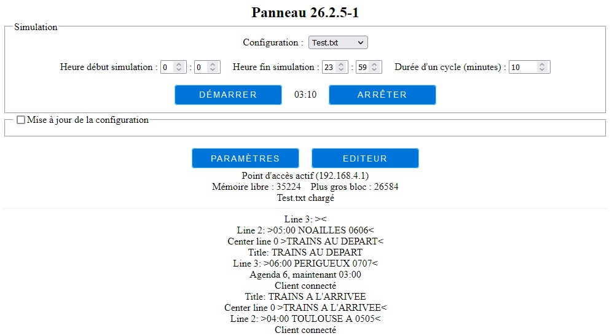
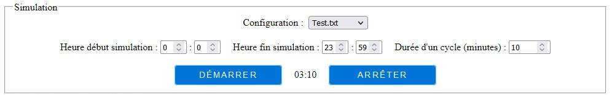
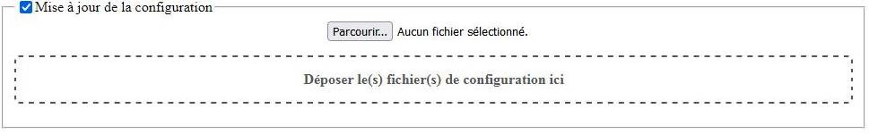
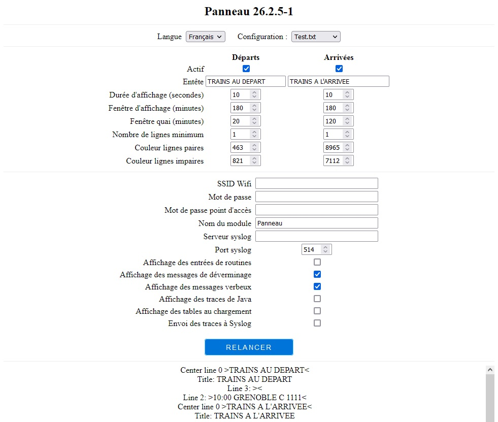
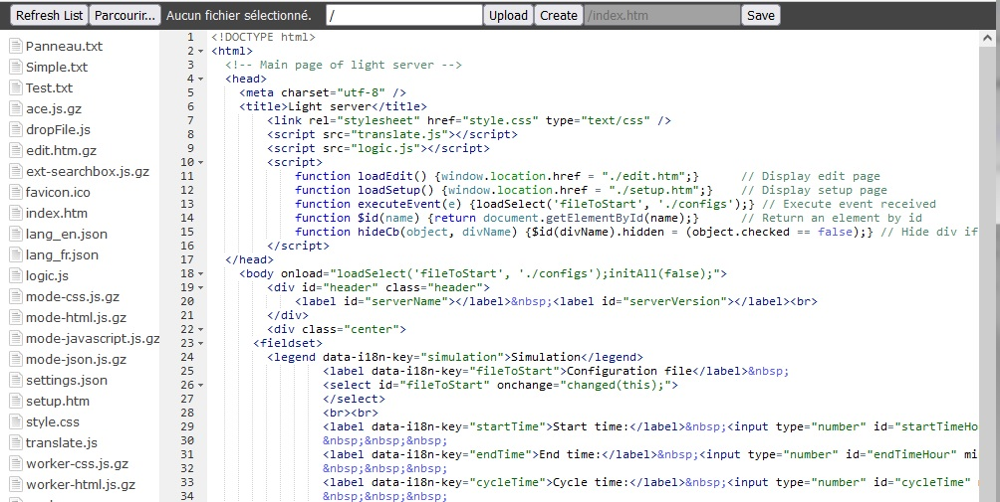

# English: Model timetable for train/Panneau d'affichage pour train électrique

[Cliquez ici pour la version française plus bas dans ce document](#france)

# <a id="english">English version</a>

## Presentation

<To be done>

# <a id="france">Version française</a>
## Présentation

Cette application permet de gérer un petit écran LCD couleur pour lui faire afficher des horaires de trains (électriques miniatures).

Elle permet d'afficher de façon cyclique la liste des départs et des arrivées tout au long (d'une partie) de la journée. Elle permet également d'afficher un message fixe, clignotant ou défilant en bas d'écran). Enfin, il est possible d'afficher un mode `Hors service` qui barre l'écran d'une croix rouge avec un message optionnel au milieu de l'écran.

L'idée de base est de présenter aux spectateurs un cycle de simulation sur une durée réduite (par exemple, une journée complète en 7 minutes).

La base est constituée d'un agenda, dont chaque ligne indique l'heure où :
	- un train arrive ou part de la gare,
	- on affiche (ou efface) un message sur le bas d'écran,
	- on met (ou en enlève) l'indication hors service.

On peut paramétrer l'écran pour afficher les départs, les arrivées, les deux ou aucun (dans ce dernier cas, on passera en mode hors service de façon permanente).

Pour chaque mode (arrivée, départ), on précise :
	- l'activation (ou pas) du mode,
	- le temps d'affichage de l'écran avant de basculer sur le suivant,
	- le nombre de ligne minimum à afficher,
	- l'intervalle de temps avant le départ ou l'arrivée du train,
	- l'intervalle de temps avant l'affichage du quai,
	- la couleur de fond des lignes paires,
	- la couleur de fond des lignes impaires.

Chaque minute (simulée), le programme met à jour l'écran, en examinant les éléments (départ ou arrivée, selon le type qu'on affiche à cet instant) et en sélectionnant ceux qui seront actifs dans l'intervalle de temps indiqué (par exemple dans les 3 heures simulées à venir) ou jusqu'à remplir le nombre de lignes minimum à afficher (même si la ligne est en dehors l'intervalle). On s'arrête lorsque la page est pleine de lignes dans l'intervalle ou qu'on a affiché le nombre minimum de lignes ou qu'on a affiché toutes les mouvements du fichier agenda.


L'application fonctionne sur un ESP8266, qui peut soit se connecter sur un réseau WiFi existant, soit créer son propre réseau Wifi. Le paramétrage s'effectue au travers d'un serveur Web embarqué, qui permet également de trouver le positionnement des LED et tester des couleurs, clignotants ou flashs en temps réel. Les messages sont affichés sur l'interface Web, et peuvent également être envoyés sur un serveur `syslog`.

L'application est autonome et sait fonctionner sans action extérieure ni connexion, en utilisant les derniers paramètres connus. Il suffit juste de la mettre l'ESP sous tension.

La suite de ce document détaille tout d'abord la structure et le contenu des fichiers de configuration, plus pratiques que l'interface Web pour charger de grandes quantités de données.

On verra ensuite l'utilisation de l'interface Web.

## Description des données utilisées

Les données relatives aux messages du panneau sont écrite dans un fichier.

Il est possible de charger plusieurs fichiers de configuration dans l'ESP, une liste déroulantes dans la page de paramètres permet de choisir celle à activer.

Le nom de ces fichiers est laissé à la discrétion de l'utilisateur, mais l'extension doit être `.txt`.

Le format interne utilisé est de type CSV (valeurs séparées par des `;`).

Chaque type de données est précédé d'une entête qui permet de s'y retrouver lorsqu'on édite les données.

Cette édition peut être faite avec un tableur (LibreOffice, OpenOffice, voire même Excel pour les plus téméraires ;-) ou à l'aide d'un simple éditeur de texte (genre NotePad++ ou similaire).

Il est possible d'ajouter des commentaires dans le fichier, histoire de s'y retrouver. Ces commentaires doivent figurer en fin de ligne, et débuter par le caractère `#`. Noter que tout ce qui suit le commentaire sur la même ligne sera simplement ignoré.

Voici un exemple de fichier vide :
```
Heure;Type;Ville/message;Quai/CouleurTexte;Train/CouleurFond
```
Pour information, seule la première zone de l'entête est testée (et doit être identique a celles de cet exemple). Il est possible de modifier les autres zones d'entête pour les faire correspondre à ses besoins.

Noter que l'encodage des accents varie selon les systèmes d'exploitation, et que le panneau ne peut afficher que des caractères sans accents. Il est prudent de ne pas en utiliser dans les fichiers de configuration, leur restitution pouvant amener à des résultats amusants ;-)

### L'agenda

Il permet de spécifier les arrivées et départs des trains, l'affichage des messages et la mise hors service du panneau.

Par exemple :
```
Heure;Type;Ville/message;Quai/CouleurTexte;Train/CouleurFond
05:41;D;ORLEANS;D;5425
06:03;D;MARSEILLE;B;1333
06:16;D;GENEVE;3;7140
06:18;A;ORLEANS;3;5428
06:20;D;LYON;C;5194
```

#### Les départs et arrivées

La ligne contient l'heure, suivi de `D` pour départ et `A` pour arrivée, puis du nom de la gare, le numéro de quai et le numéro de train.

L'ensemble des zones est obligatoire.

L'heure est spécifiée au format `HH:MN` sur 5 caractères.

Seuls les 13 premiers caractères du nom de la ville seront affichés (les autres sont juste ignorés). De même, le numéro de quai est limité à 1 caractère, et le numéro de train à 4.

#### Les message de bas d'affichage

Ils sont affichés sur la dernière ligne de l'affichage. Seul le dernier message est affichés, chaque nouveau message efface le précédent. On désactive le message en cours en envoyant un message vide.

La ligne contient l'heure suivi de  `MF` pour un `Message Fixe`, `MC` pour un `Message Clignotant` et `MD` pour un `Message Défilant`, puis du message, de la couleur du texte et de la couleur du fond de la ligne.

Les couleurs sont indiquées au format 5-6-5, qui code une couleur sur 16 bits avec 5 bits pour le rouge, 6 pour le vert et 5 pour le bleu. Le résultat est un nombre compris entre 0 (noir) et 65535 (blanc).

Pour les réfractaires, on peut remplacer ces valeurs numériques par `orange`, `noir`, `blanc`, `rouge`, `vert`, `bleu`, `jaune`, `cyan` ou `magenta`.

Seuls les 26 premiers caractères du message sont affichés, les autres sont ignorés. Attention aux accents !

Par défaut, un message vide désactive le message sur la dernière ligne (qui est réutilisée si besoin pour afficher un départ/arrivée supplémentaire), une couleur de texte non spécifiée sera blanche et une couleur de fond non spécifiée noire.

Par exemple :
```
Heure;Type;Ville/message;Quai/CouleurTexte;Train/CouleurFond
07:21;MF;MESSAGE FIXE;BLANC;ROUGE#			# Affiche le message "MESSAGE FIXE" en blanc sur fond rouge à partir de 7h31
07:24;MC;MESSAGE CLIGNOTANT;NOIR,BLANC		# Affiche le message clignotant "MESSAGE CLIGNOTANT" en noir sur fond blanc à partir de 7h24
07:33;MD;Message defilant					# Affiche le message défilant "Message defilant" en blanc sur fond noir à partir de 7h33
07:37;MF									# Efface le message à 7h37 Note: On aurait pu mettre aussi "MC" ou "MF" pour avoir le même résultat.
```

#### L'indication "Hors service"

Elle efface l'écran , et affiche une croix rouge à partir des 4 coins, avec un texte au centre de l'écran. On désactive ce mode en envoyant un texte vide, l'affichage des départs et arrivées reprendra ensuite.

La ligne contient l'heure suivi de  `HS` pour un `Hors Service`, puis du texte, de la couleur du texte et de la couleur du fond de la ligne.

Comme pour les messages de bas d'affichage, les couleurs sont spécifiées au format (5-6-5), la liste des couleurs déjà citée est utilisable.

Seuls les 26 premiers caractères du message sont affichés, les autres sont ignorés. Attention aux accents !

Par défaut, un texte vide désactive l'indication(et l'affichage des départs et/ou arrivées reprend), une couleur de texte non spécifiée sera blanche et une couleur de fond non spécifiée noire.

## Le serveur Web embarqué

L'interaction entre l'utilisateur et l'ESP s'effectue au travers d'un serveur Web embarqué, à l'aide d'un navigateur Web, depuis un téléphone ou un ordinateur.

L'adresse à utiliser dépend du paramétrage fait par l'utilisateur.

Dans le cas le plus courant où le module n'est pas connecté à un réseau WiFi existant, il faut connecter le téléphone ou l'ordinateur au réseau WiFi du module (avec les valeurs par défaut, il se nomme `Panneau_xxxxxx` où `xxxxxx` représente la fin de l'adresse MAC du module). On se connecte alors au serveur par `http://192.168.4.1/`

Si on a précisé un réseau WiFi (et que celui-ci a pu être joint au démarrage du module), on sera alors connecté à ce réseau, et c'est le routeur du réseau qui lui affectera son adresse IP.

Dans tous les cas, le nom du réseau et l'IP à utiliser sont affichés sur le port console (USB) de l'ESP au lancement.

### La page principale

La page principale `/` ou `/index.htm` du serveur Web embarqué ressemble à :



Elle est composée de plusieurs parties :

#### L'entête



On y trouve tout d'abord le nom du module sur la première ligne.

Le cadre `Simulation` regroupe les informations sur la ... simulation ce qui, je dois le reconnaître, n'est pas banal ;-)

Le sélecteur `Configuration` permet de choisir le fichier de configuration à utiliser. La liste déroulante montre les différents fichiers disponibles sur l'ESP.

On trouve ensuite de quoi saisir les heures et minutes de début et fin de simulation. En principe, on devrait avoir `00:00` et `23:59`, mais il est possible au travers de ces zones de réduire l'intervalle, soit pour ne présenter qu'une partie de la journée, soit pour affiner le déverminage d'un passage compliqué.

Une fois les heures de début/fin saisies, on doit indiquer la durée d'un cycle de simulation, en minutes.

Noter que le fait de réduire l'intervalle de simulation va sensiblement la ralentir.

A titre indicatif, des durées entre 5 et 10 minutes semblent raisonnables.

La ligne suivante permet de régler la luminosité globale des LED, afin de s'adapter à la lumière présente dans la pièce où la simulation se déroule (en principe, on éclaire moins dans le noir qu'en plein jour).

On démarre et arrête la simulation par les boutons du même nom.

L'heure simulée est indiquée entre ces deux boutons. Elle est mise à jour en temps réel lorsque la simulation est active, sinon on affichera `Arrêté à xx:xx`.

#### Le cadre de mise à jour de la configuration



Le contenu de ce cadre n'est visible que si sa case est cochée.

Il est utilisé pour charger un fichier de configuration décrit plus haut.

Il est possible d'indiquer le fichier à utiliser :

- soit en cliquant sur le bouton `Parcourir`, puis en sélectionnant le fichier dans la boîte de dialogue qui va s'ouvrir,
- soit en faisant glisser/lâcher (drag & drop) le fichier sur la case `Déposer le fichier de configuration ici`.

Le fichier sera alors chargé dans l'ESP, et son analyse lancée.

Les éventuelles erreurs seront affichées dans le cadre de trace, l'état final sera repris dans le cadre d'état. De plus, l'écran affichera `HORS SERVICE` (avec sa croix rouge), et le code de l'erreur sera affiché sur la dernière ligne.

#### Le cadre d'état


Ce cadre permet :

- d'afficher la page de paramètres en cliquant sur le bouton `Paramètres` (voir ci-dessous),
- d'afficher la page de l'éditeur de fichiers en cliquant sur le bouton `Éditeur` (voir ci-dessous),
- d'afficher une ligne indiquant l'état du WiFi (point d'accès local ou WiFi existant) et l'adresse IP de l'ESP,
- d'afficher une ligne indiquant la mémoire disponible, et la taille du plus gros bloc (déverminage),
- d'afficher une ligne indiquant le résultat du dernier chargement des fichiers paramètres (`<Nom du fichier de configuration> chargé` si pas d'erreur, message d'erreur sinon).

#### Le cadre de trace


Ce cadre contient la liste des traces émises par l'ESP, la dernière ligne affichée en haut de la liste.

Des explications sur les différents messages figurent au chapitre `Les traces générées par le système`.

### La page de paramétrage du système

La page de paramétrage `/setup` du serveur Web embarqué ressemble à :



La première ligne contient est un sélecteur `Langue` qui indique ... la langue utilisée pour l'affichage des pages de ce navigateur (bien vu, non ?).

Si le navigateur supporte le Français, on l'utilisera. Sinon, on basculera automatiquement en Anglais.

Noter que la langue du serveur est définie au moment de la compilation.

Le sélecteur `Configuration` permet de choisir le fichier de configuration à utiliser. La liste déroulante montre les différents fichiers disponibles sur l'ESP.

Le cadre suivant permet de définir les paramètres pour les départs et arrivées :

- `Actif` permet d'activer (ou pas) la colonne. Noter que si les 2 colonnes sont désactivées, l'affichage passera en `Hors service`,
- `Durée d'affichage (secondes)` précise la durée où la colonne sera active. Après cette durée, l'affichage basculera sur l'autre colonne, si elle est active (sinon, on restera sur cette colonne),
- `Fenêtre d'affichage (minutes)` donne la durée pendant laquelle on cherchera les éléments à afficher. Par exemple, 180 minutes (3 heures) permet d'afficher seulement les départs/arrivées dans les 3 prochaines heures,
- `Fenêtre quai (minutes)` spécifie le nombre de minutes avant le départ ou l'arrivée avant d'afficher le numéro de quai (souvent 20),
- `Nombre de lignes minimum` indique le remplissage minimum de la table des départs/arrivées (ce qui veut dire qu'on aura toujours au minimum ce nombre de lignes affichées, même si les départs/arrivées sont hors limite),
- `Couleur lignes paires` et `Couleur lignes impaires` précisent la couleur de fond des lignes paires et impaires, comme sur un panneau SNCF.

Le cadre suivant contient les informations sur les paramètre réseau de l'ESP :

- `SSID Wifi` indique le nom du réseau WiFi existant sur lequel connecter le module. S'il n'est pas défini, ou ne peut être localisé durant les 10 premières secondes de vie de l'ESP, on basculera sur un point d'accès WiFi crée par l'ESP,
- `Mot de passe` indique le mot de passe associé au SSID WiFi précédent, s'il en possède un,
- `Mot de passe point d'accès` indique le mot de passe associé au point d'accès généré par l'ESP (qui ne sera pas protégé si laissé vide),
- `Nom du module` précise le nom réseau associé au module (pour le distinguer des autres modules le cas échéant).

Le cadre suivant contient les informations dans le cas où on souhaiterait envoyer les traces à un serveur de log de type `syslog` :

- `Serveur syslog` indique le nom ou l'adresse IP du serveur (vide, on n'utilisera pas de serveur `syslog`),
- `Port syslog` précise le numéro de port à utiliser (par défaut 514).

Viennent ensuite des indicateurs utilisés pour contrôler les types de message de trace à afficher/envoyer. Ils sont tous utilisés pour le déverminage :

- `Affichage des entrées de routines` est utilisé afficher le nom des principales routines utilisées par le module,
- `Affichage des messages de déverminage` fait ce qu'on pense qu'il va faire,
- `Affichage des messages verbeux` ajoute plus de messages à la trace,
- `Affichage des traces Java` affiche des messages de trace des modules JavaScript,
- `Affichage des tables au chargement` affiche le contenu des tables après leur chargement,
- `Envoi des traces à Syslog` permet d'activer l'envoi des traces au serveur `syslog`.

Le bouton `Relancer` permet de ... relancer le module (encore bien vu!). Il est utile lorsqu'on modifie un paramètre qui nécessite un redémarrage (comme tout ce qui touche aux caractéristiques du ruban ou aux réglages du WiFi).

La dernière partie contient la trace déjà décrite plus haut.

### La page de gestion des fichiers embarqués

La page de gestion des fichiers embarqués `/edit` du serveur Web embarqué ressemble à :



Elle permet de lister les fichiers présents sur l'ESP dans la partie gauche, de les modifier, supprimer, télécharger, d'en créer de nouveau vides ou à partir d'un fichier présent sur l'ordinateur ou le portable utilisé.

A n'utiliser que sur demande.

## Les traces générées par le système

Le système génère plus ou moins (selon les indicateurs définis dans les paramètres précédemment exposés) de traces.

Ces traces proviennent de deux sources : l'ESP et le navigateur.

### Les traces de l'ESP

Ce sont les traces émises par l'ESP lui même, pour indiquer son état et reporter les erreurs qu'il pourrait détecter. On trouve :

#### Les traces de l'analyse des fichiers de paramétrage

Comme déjà expliqué, l'ESP analyse les fichiers de configuration pendant son lancement, et après chaque téléchargement de fichier.

Il est possible qu'il détecte des incohérences pendant cette analyse. Il les signalera par un message donnant des informations sur le problème. L'affichage d'une erreur provoquera l'arrêt de l'analyse, et empêchera l'activation de la simulation (mais laissera la possibilité d'utiliser le test des LED, et le chargement de nouveaux fichiers).

Dans ce qui suit les parties variables sont précisées entre `< >`. Par exemple, `<numéro de ligne>` sera remplacé par le numéro de ligne du fichier concerné.

On trouvera :

- `Ne peut ouvrir <nom de fichier>` : problème lors de l'ouverture du fichier,
- `Entête <entête du fichier> incorrecte dans <nom du fichier>` : la première ligne du fichier ne semble pas être une entête correcte. L'entête est testée sur sa première zone, qui doit être `Agenda`,
- `Fichier <nom du fichier> manquant` : le fichier n'a pas pu être trouvé,
- `Zones <type de zone> déjà définie dans <nom de fichier> avant la ligne <numéro de ligne>` : un même type de zone est défini deux fois dans le fichier, la seconde sur la ligne spécifiée,
- `Nb zones (<nombre de zones>) incorrect ligne <numéro de ligne> de <nom de fichier>` : le nombre de zones de la ligne est incorrect (soit inférieur au nombre minimum de zones demandées, soit supérieur au nombre maximum de zones définies),
- `Valeur <valeur donnée> incorrecte, zone <numéro de zone>, ligne <numéro de ligne> de <nom de fichier>` : la valeur donnée pour la zone n'est pas celle attendue,
- `Valeur <valeur donnée> hors limite, zone <numéro de zone>, ligne <numéro de ligne> de <nom de fichier>` : la valeur donnée est hors des limites imposées,
- `Heure <heure donnée> incorrecte, zone <numéro de zone>, ligne <numéro de ligne> de <nom de fichier>` : l'heure spécifiée est incorrecte,
- `Couleur <couleur> inconnue, zone , zone <numéro de zone>, ligne <numéro de ligne> de <nom de fichier>` : le nom de couleur spécifié n'est pas reconnu (doit être `orange`, `noir`, `blanc`, `rouge`, `vert`, `bleu`, `jaune`, `cyan` ou `magenta`),
- `Erreur <numéro de l'erreur> inconnue, fichier <nom de fichier>, ligne <numéro de ligne>, entier <valeur entière>, chaîne <chaîne de caractères>` : le programme ne sait pas décoder une erreur. L'ensemble des paramètres envoyés à la procédure est affiché. A faire remonter au développeur.

#### Les traces de l'exécution de la simulation

Le programme envoie certains messages pour informer l'utilisateur de son avancement.

Les principaux sont :

- `Agenda <numéro de ligne de l'agenda>, maintenant <heure de simulation>` : informe de l'activation de l'agenda à une heure de simulation données (permet de suivre où on en est dans la simulation, et quelle(s) ligne(s) va(vont) être exécutée(s),
- `On passe de <heure de fin> à <heure de début>` : indique la fin d'un cycle de simulation,
- `Titre : <titre de la page>`, `Ligne <numéro de ligne> <Contenu de la ligne>`, `Ligne centrée <numéro de ligne> <Contenu de la ligne>` précisent le titre et le contenu des lignes affichées sur le panneau,
- `Message <contenu du message>, type <type de message>` : donne le message et le type (1=fixe, 2=clignotant, 3=défilant) de message,
- `Hors service <texte du message>` : précise le message `hors service`.

#### Les autres traces

D'autres messages peuvent être envoyés. Il est possible de râler auprès du développeur s'ils ne sont pas assez clairs ;-)

### Les traces du navigateur

En plus des messages générés par le serveur, certaines erreurs générés par le navigateur seront également affichées dans la zone de trace des erreurs.

En particulier, les traces Java si elles sont activées, et les erreurs graves lorsqu'elles se produisent dans le navigateur.

## Les requêtes supportées par le serveur Web

Le serveur Web embarqué répond aux URL suivantes :

- `/` : affiche la page d'accueil,
- `/status` : retourne l'état du programme sous forme JSON,
- `/setup` : affiche la page de paramètres,
- `/settings` : retourne la paramètres au format JSON,
- `/configs` : retourne la liste des fichiers de configuration présents sur l'ESP,
- `/debug` : retourne les variables internes pour déverminer,
- `/log` : retourne les dernières lignes du log mémorisé,
- `/edit` : gère et édite le système de fichier,
- `/tables` : retourne le contenu de l'ensemble des tables du programme,
- `/rest/restart` : redémarre l'ESP,
- `/command/enable/enter` : arme l'indicateur `Affichage des entrées de routines`,
- `/command/enable/debug` : arme l'indicateur `Affichage des messages de déverminage`,
- `/command/enable/verbose` : arme l'indicateur `Affichage des messages verbeux`,
- `/command/enable/java` : arme l'indicateur `Affichage des traces Java`,
- `/command/enable/table` : arme l'indicateur `Affichage des tables au chargement`,
- `/command/enable/syslog` : arme l'indicateur `Envoi des traces à syslog`,
- `/command/disable/enter` : désarme l'indicateur `Affichage des entrées de routines`,
- `/command/disable/debug` : désarme l'indicateur `Affichage des messages de déverminage`,
- `/command/disable/verbose` : désarme l'indicateur `Affichage des messages verbeux`,
- `/command/disable/java` : désarme l'indicateur `Affichage des traces Java`,
- `/command/disable/table` : désarme l'indicateur `Affichage des tables au chargement`,
- `/command/disable/syslog` : désarme l'indicateur `Envoi des traces à syslog`,
- `/languages` : Retourne la liste des langues supportées,
- `/changed` : change la valeur d'une variable (utilisation interne),
- `/upload` : charge un fichier (utilisation interne).
